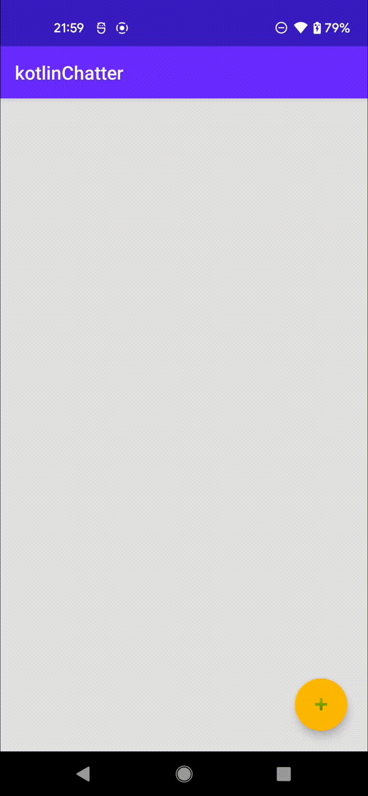
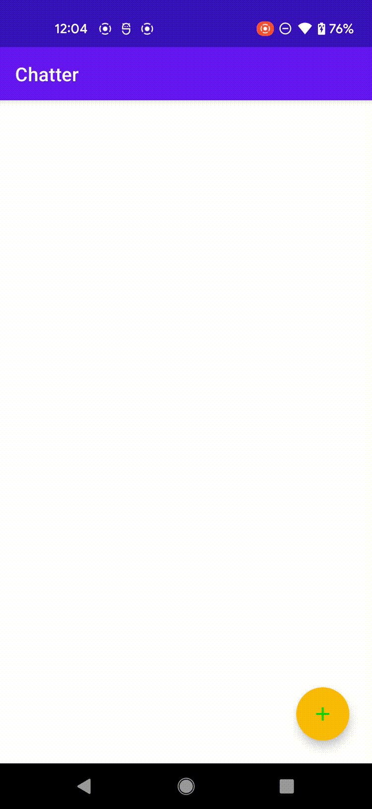

# Kotlin App Sample
EECS 441 
Mobile App Development for Entrepreneurs 
- Semester: 2021fall
- Language: Kotlin

# lab 0 Chatter
Chatter is a simple chat app that is cheaply inspired by Twitter. In this first iteration, user can only post textual chatt. In subsequent labs, we will add, in turn, image and video, location information, audio, and authentication. Each subsequent lab will build upon this lab only, not on each other, though you’re free (but not recommended) to make them cumulative.  

  

# lab 1 Chatter with Images
In this lab, we will be using Android’s common Camera component to add and manipulate images and videos in Chatter.

  

# lab 2 Chatter with Maps and Programmatic UI
The goal of this lab is two fold: First, to introduce you to programmatic UI development, without Layout Editor. Second, to integrate Google Maps with the Chatter app. We will first refactor out Layout Editor from our lab0 code. We’ll assume that you’re already familiar with ConstraintLayout and the concept of layout constraints.

In the maps-augmented Chatter app, we will add the Map View. On the map, there will be multiple markers. Each marker represents one chatt. If you click on a marker, it will display the poster’s username, message, timestamp, and their geodata, consisting of their geolocation and velocity (compass-point facing and movement speed), captured at the time the chatt was post.

We will also implement a swiping gesture to allow users to switch from the default timeline view to the map view. From the map view, users can not post a chatt; they can only return to the timeline view. Once a user posts a chatt, they also can only return to the timeline view, not the map view. When a user transitions from the timeline view to the map view, the current trove of retrieved chatts will be passed along for display on the map view. User cannot initiate a new retrieval of chatts in the map view.

# lab 3 Chatter with Audio and Declarative UI
We have two goals with this lab: first, to introduce you to declarative UI development using Android Jetpack Compose, with its reactive programming framework, and second, to add audio support to Chatter.  

# lab 4 Chatter with Sign-in and Coroutines
In this lab, we add Google Sign-In, with biometric authentication, to Chatter built using declarative UI. We also develop the code using coroutines instead of relying solely on callbacks.  

